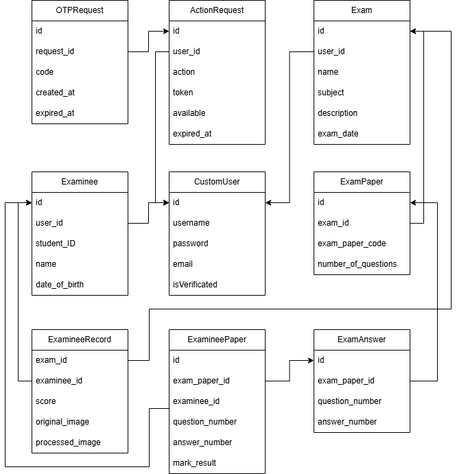

# **TestMarkDB API**

## 🚀 Built with the following technologies

 

---

## 📘 **Introduction**

TestMarkDB API is a backend system that supports managing exams, test papers, candidates, and automatically grading multiple-choice answer sheets from images. The system aims to reduce scoring time, automatically extract candidate IDs, test codes, and answers from filled answer sheets, ensure account security through email verification and OTP-based password recovery, and provide clear APIs for frontend applications or integrated services.

---

## ✨ **Main Features**

- Manage exam-related data (Exam, ExamPaper, ExamAnswer, Examinee, ExamineeRecord).
- AI pipeline that processes answer sheet images and produces selected-answer results.
- Secure email authentication flow using OTP.
- Containerized deployment (Docker + Nginx + uWSGI).

---

## 🧩 **Entity–Relationship Model**

---

## 🏷️ **Entities**

- **CustomUser**: Stores lecturer information and acts as the owner of exams and their examinees.
- **Exam**: Represents an exam created by a lecturer; each exam can contain multiple exam papers.
- **ExamPaper**: Represents a test paper (test code) within an exam and links to its official answer key.
- **ExamAnswer**: Stores the correct answer for each question in a specific exam paper.
- **Examinee**: Stores information about examinees managed by the lecturer.
- **ExamineeRecord**: Tracks a single attempt of an examinee in an exam, including candidate ID, answer-sheet image, and final score.
- **ExamineePaper**: Stores the examinee’s selected answers for each question, including correctness.
- **ActionRequest & OTPRequest**: Support security workflows by creating authentication actions and generating OTP codes for email verification or password reset.

---

## 🔗 **Main Relationships**

- A CustomUser can have multiple Exams and Examinees.
- An Exam has multiple ExamPapers, and each paper has multiple ExamAnswers.
- Exam ↔ Examinee is a many-to-many relationship via ExamineeRecord.
- ExamPaper ↔ Examinee is a many-to-many relationship via ExamineePaper.
- A CustomUser can have multiple ActionRequests, and each may generate multiple OTPRequests within its validity period.

---

## 📡 **API Groups**

### **Authentication**
- POST `/api/Register/` → `RegisterView`
- POST `/api/SendOTPForVerify/` → `SendOTPForVerifyView`
- POST `/api/VerifyOTP/` → `VerifyOTPView`
- POST `/api/VerifyEmail/` → `VerifyEmailView`
- POST `/api/ChangePassword/` → `ChangePasswordView`
- POST `/api/PasswordReset/` → `PasswordResetView`

### **Exams & Papers**
- CRUD `/api/Exams/` → `ExamViewSet`
- Nested `/api/Exams/{exam_pk}/Papers/` → `ExamPaperViewSet`
- CRUD `/api/ExamPapers/{exam_paper_pk}/Answers/` → `ExamAnswerViewSet`
- POST `/api/ExamPapers/{exam_paper_pk}/BatchAnswer/` → `ExamPaperBatchAnswerView`

### **Examinees & Records**
- CRUD `/api/Examinees/` → `ExamineeViewSet`
- CRUD `/api/ExamineeRecords/` → `ExamineeRecordViewSet`
- GET `/api/Examinee/{examinee_id}/RecordsDetail/` → `ExamineeRecordDetailView`
- GET `/api/ExamineeRecords/{id}/Result/` → `ExamineeResultViewSet`

### **AI & Images**
- POST `/api/ImageProcess/` → `ImageProcessView`
- POST `/api/ImageProcessSave/` → `ImageProcessSaveView`
- GET/POST `/api/CameraStream/{id}/` → `CameraStreamView`

---

## 🔄 **Important Workflows**

### **Email Verification via OTP**
1. User registers → status unverified (`isVerificated`).
2. POST `/api/SendOTPForVerify/` (email + action=email_verify):
   - Generate 24-char base62 token (`randomX.randomX`).
   - Create `ActionRequest` (expired_at + available=False).
   - Generate 4-digit OTP (`randomX.randomOTP`) → saved to `OTPRequest`.
   - Send HTML email via Celery (`send_otp`).
3. POST `/api/VerifyOTP/` (token + code):
   - Validate expiration + correct code.
   - Mark ActionRequest.available=True.
4. POST `/api/VerifyEmail/` (token):
   - Confirm validity → set `isVerificated=True`.

Additional notes:
- 24-char token reduces collision risk.
- OTP lifetime: 5 minutes.

---

### **Grading From Answer Sheet Image**

1. POST `/api/ImageProcess/`:
   - Save temporary file with random name (`randomFileName`).
   - Run `process_image` → wrapper to `No_Le_AI.process`.

2. **AI Pipeline (`No_Le_AI.process`):**
   - Load YOLO models (`region_model`, `bubble_model`).
   - Detect regions (Answer_region, MaDe_region, SBD_region).
   - Validate (`is_region_correct`).
   - Read SBD (`read_sbd`, grid 10x6).
   - Read MaDe (`read_made`, grid 10x3).
   - Read answers (`read_answer`):
     - Cluster bubbles (median width).
     - 10 questions per group → mapping to matrix.

3. Return JSON (SBD, MaDe, answers).

4. POST `/api/ImageProcessSave/`:
   - Create `ExamineeRecord`.
   - Compare answers with `ExamAnswer`.
   - Create `ExamineePaper` entries.

5. GET `/api/ExamineeRecords/{id}/Result/`.

---

## 🔐 **Security & Authorization**

- JWT RS512 with private/public keys.
- Access token: 1 day; Refresh token: 7 days.
- Multi-algorithm password hashing (Argon2 preferred).
- Default permission: `IsAuthenticated`.
- Custom permission: `IsVerificated`.
- Action limits for email_verify and password_reset.

---

## ▶️ **Usage**

1. Create `.env` file (see `docs/.env-example`).
2. `docker compose -f docker-compose.yml build`
3. `docker compose -f docker-compose.yml up -d`
4. `docker compose -f docker-compose.yml logs -f`

---

## 🚀 **Future Development**

- Automated tests (pytest + GitHub Actions).
- OTP rate limiting (Redis).
- Improve AI accuracy (fine-tuning, augmentation).
- Add analytics: score distribution, per-question correctness.
- Add WebSocket realtime camera streaming.

---

## 🤝 Contributing
All contributions are welcome! Please create issues or pull requests.

---

## 📝 License
This project is licensed under the [MIT License](LICENSE).